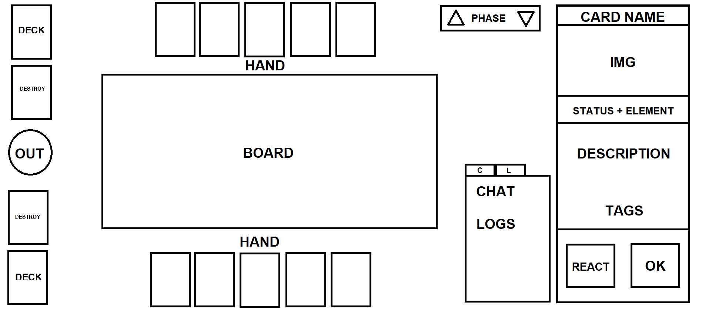

# "Dominion Card Game" Simulator

## The Idea

Make a board game simulator to my card game called "Dominion" (temporary title).
The game rules are still a work in progress.
The main idea for a V1 is to make a online board open to interactions similar to Dueling Book in Yu-Gi-Oh, where the players have total control of the interaction of the game and the social contract of the game rules will made them play fair, similar to a any non-digital boardgame.

## Rules

WIP

## Actions

Possible actions that you can do in the simulator and where you can do it:

- Deck
  - [x] Draw Card
    - Draw 1 card from the Top of the Deck
  - [x] Draw For Turn
    - Draw until you reach the max cards for DRAW ACTION (4 cards)
  - [x] Search Card To Hand
    - Get one specific card from Deck to Hand
  - [x] Search Card To DZ
    - Get one specific card from Deck to Destroy Zone
  - [x] Search Card To OOG
    - Get one specific card from Deck to OUT OF GAME
  - [x] Shuffle Deck
    - Shuffle entire Deck
  - [x] Mill
    - Discard the top card from your deck
- Card in Hand
  - [x] SPAWN Face-up
    - Put card in Board in Face-up position
  - [x] SPAWN Face-down
    - Put card in Board in Face-down position
  - [x] Back to TOP of the Deck
    - Put card in the deck array at the DRAW position
  - [x] Back to BOTTOM of the Deck
    - Put card at the end of deck array
  - [x] Back to Deck + Shuffle
    - Put card at the top of deck and SHUFFLE
  - [x] Destroy
    - Put card at the Destroyed Zone
  - [x] FINISH
    - Put card OUT OF THE GAME
- Card in Board
  - [x] Bounce
  - [x] Destroy
  - [x] FINISH
  - [x] Move
  - [x] Attack
  - [x] Flip
  - [x] Activate
  - [x] Change Status Window
  - [ ] TICK Cooldown
  - [x] Check all Stacked Cards
  - [x] Put card in back
  - [x] Put card on top
  - [ ] Attach Card
- Card in Destroyed Zone
  - [x] Reborn
    - Put card back to Board
  - [x] Back to Hand
    - Put card back to Hand
  - [x] FINISH
    - Put card OUT OF THE GAME
- Card OUT OF THE GAME
  - [x] Recycle
    - Put card back at the Destroyed Zone
- Board Controls
  - [ ] START Turn
    - Start your turn
  - [ ] TICK Phase
    - Start your TICK Phase
  - [ ] MOVE Phase
    - Start your MOVE Phase
  - [ ] BATTLE Phase
    - Start your BATTLE Phase
  - [ ] SPAWN Phase
    - Start your SPAWN Phase
  - [ ] Create TOKEN Card
    - Create a Pseudo-Card to put in Board
  - [x] END Turn
    - Finish your turn
  - [x] REACTION
    - Declare to your opponent that you have a REACTION
  - [ ] OK
    - Declare to your opponent that you accept the state and have NO REACTION

## Layout

Prototype Layout for simulator:

## Links

- [Release Plans](RELEASES.md)
- [Boardgame.io Documentation](https://boardgame.io/documentation/#/)
