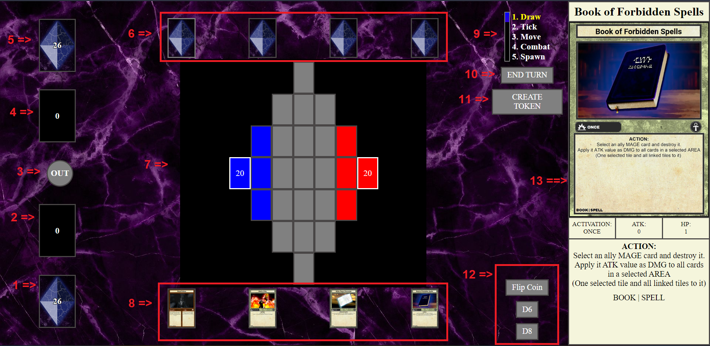
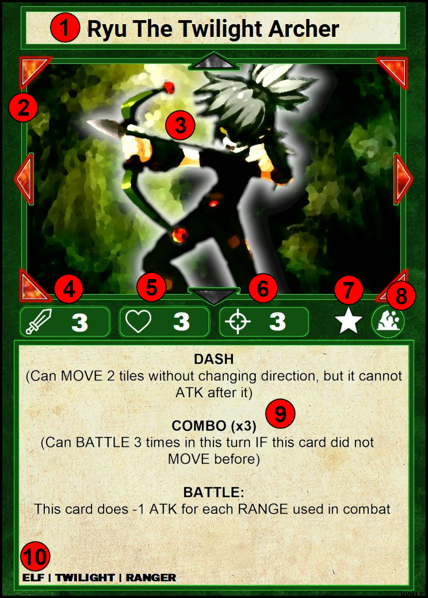
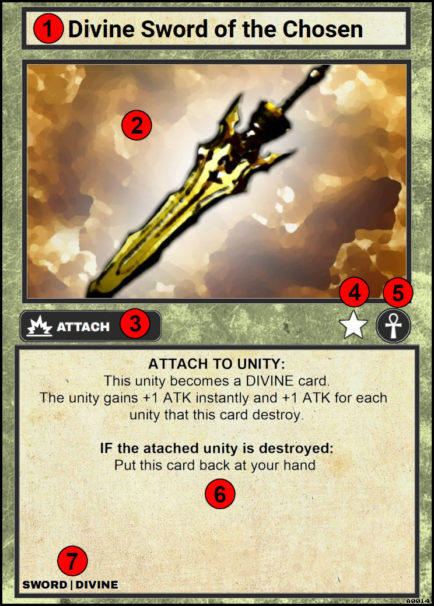
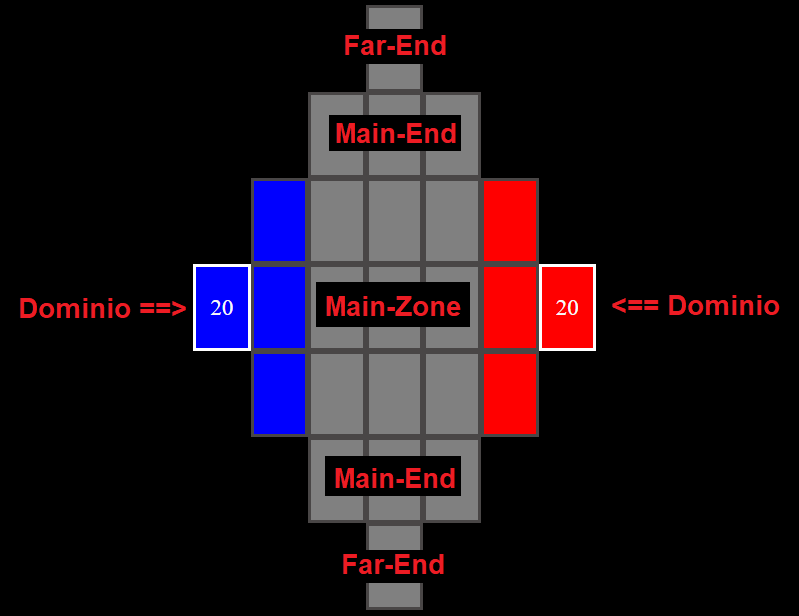

# Dimensional Dominions Regras (PT-BR)

## Indice

1. [Setup](#setup)
2. [Layout do Jogo](#layout-do-jogo)
3. [Baralho](#baralho)
4. [Cartas](#cartas)
   - [Unidade](#unidade)
   - [Artefato](#artefato)
   - [Campo](#campo)
5. [Zona de Descarte (DZ)](#zona-de-descarte-dz)
6. [Cartas Fora do Jogo (OOG)](#cartas-fora-do-jogo-oog)
7. [Tabuleiro](#tabuleiro)
8. [Objetivo](#objetivo)

## Setup

- O jogo consiste em dois jogadores (1x1) com a presença de um tabuleiro.
- Cada jogador deve possuir um deck de 30 cartas que será utilizado durante a partida.
- O jogo começa com cada jogador com 10 pontos de vida em seu Dominio

---

## Layout do Jogo

O jogo é dividido nas seguintes seções de acordo com a imagem acima:

1. Seu [Baralho](#baralho).
2. Sua [Zona de Descarte (DZ)](#zona-de-descarte-dz).
3. [Cartas foras do Jogo (Out Of the Game - OOG)](#cartas-fora-do-jogo-oog).
4. [Zona de Descarte](#zona-de-descarte-dz) de seu adversário.
5. [Baralho](#baralho) do seu adversário.
6. Cartas que estão na mão de seu adversário
7. [Tabuleiro](#tabuleiro)
8. Cartas que estão na sua mão
9. Barra de [Fases](#fases) do Turno.
10. Botão de Finalizar Turno
11. Botão de Gerar uma Carta do tipo [TOKEN](#token)
12. Botões para ativar um evento aleatório como lançar uma moeda ou jogar um dado de 6 ou 8 lados.
13. Informações mais detalhadas da ultima carta que seu mouse passou por cima.

**Todas as seções serão explicadas com mais detalhes neste documento.**

---

## Baralho

- Todo Baralho deve ter exatamente 30 cartas.
- Seu baralho pode conter apenas duas cartas com o mesmo nome (duplicata), com exceção de cartas ÚNICAS, marcadas com uma estrela.
- Um baralho pode conter cartas do tipo:
  - [Unidade](#unidade)
  - [Artefato](#artefato)
  - [Campo](#campo)
- Seu baralho pode conter qualquer quantidade de qualquer tipo de carta, porém é recomendado utilizar uma quantidade maior de cartas tipo unidade.

---

## Cartas

Em Dimensional Dominions, todas as cartas são divididas em quatro tipos distintos:

- [Unidade](#unidade)
- [Artefato](#artefato)
- [Campo](#campo)
- [Token](#token)

Mesmo tendo grandes diferenças em seus papéis e estilos durante o jogo, muitas delas possuem informações em comuns. Como:

- Nome
- Arte
- Estrela de identificação de Carta UNICA
- Simbolo de identidade
- Espaço para descrição de seu efeito ou efeitos
- Subtipos da carta (TAGs)

#### **Cartas Unicas**

#### **Subtipos (TAGs)**

### **Unidade**

Unidade são as principais cartas do jogo, são elas que se movem e travam combates pelo tabuleiro. Elas são as unicas cartas que podem dar dano diretamente no Dominio de seu inimigo.

Elas são compostas dos seguintes itens:

1. Nome da Unidade
2. Range Direcional da Unidade (DIRECTION RANGE)
3. Arte da Carta
4. Pontos de Ataque da Unidade (ATK)
5. Pontos de Vida da Unidade (HP)
6. Range de Distancia da Unidade (RANGE)
7. Estrela que indica que a Carta é UNICA
8. Simbolo que identifica o Elemento da Unidade
9. Efeitos da Carta
10. Subtipos da Unidade (TAGs)

     

#### **Informações de Combate**

#### **Elementos**

### **Artefato**

Artefatos são as cartas que causam efeitos no jogo, podendo alterar o rumo da partida ou causar vantagens e ou desvantagens constantes no jogo.

Elas são compostas dos seguintes itens:

1. Nome do Artefato
2. Arte da Carta
3. Tipo de Ativação do Artefato
4. Estrela que indica que a Carta é UNICA
5. Simbolo que identifica que a carta é um artefato
6. Efeitos da Carta
7. Subtipos do Artefato (TAGs)

    

#### **Tipos de Ativação:**

### **Campo**

### **Token**

---

## Zona de Descarte (DZ)

- Todas as cartas destruidas ou descartadas durante o jogo devem ser colocadas na sua Zona de Descarte (DZ).
- Todas as cartas no DZ são de conhecimento publico dos jogadores.
  - Qualquer jogador pode verificar quais e quantas cartas se encontram em seu DZ ou no DZ de seu adversário.
- Cartas que por algum efeito externo trocaram de controle para seu adversário ou vice-versa quando destruidas são alocadas no DZ de seu jogador original.

---

## Cartas fora do Jogo (OOG)

- Toda as cartas que por algum efeito próprio ou externo forem removidas completamente do jogo devem ser colocadas neste espaço.
- Todas as cartas alocadas no OOG são de conhecimento publico.
- Cartas no OGG possuem uma borda colorida que sinaliza seu jogador original.
  - Vermelho: Adversário
  - Azul: Sua
- Uma vez que a carta é alocada neste espaço ela esta completamente **FORA DO JOGO**. Nenhum efeito pode ou deve afeta-la, nenhum efeito pode ou deve move-la desse espaço.
  - Existe um botão para realocar a carta do OOG no DZ em caso de missclick.

---

## Tabuleiro

O Tabuleiro é composto da seguinte maneira:

Dominio é o ponto principal de cada jogador, ele não deve ser preenchido com nenhuma carta e ele diz o numero de pontos de vida restantes do jogador.

Todo jogador começa no Dominio de cor azul e seu adversário no vermelho.

Fisicamente cada jogador ficaria em um lado oposto da mesa onde cada um ficaria de frente para um Far-End diferente, fazendo com que as cartas de seu adversário fiquem de cabeça para baixo em sua perspectiva. Isto é feito automaticamente na versão digital.

Por este motivo é relativo chamar um Far-End ou Main-End de Norte ou Sul, pois o Far-End Norte na sua perspectiva seria o Far-End Sul na perspectiva do jogador adversário.

---

## Objetivo

O jogador que reduzir a vida do Dominio de seu adverário a **ZERO** é considerado o vencedor.

O jogador pode declarar um ataque contra o Dominio de seu adversário se:

- Possuir uma carta do tipo unidade nas zonas adjacentes do Dominio de seu adversário (zonas coloridas).
- Cartas unidades com ataque a distancia não podem atacar o dominio a distancia, elas tambem devem respeitar a regra acima.
- Cartas unidades que se encontra na zona adjacente podem atacar o Dominio mesmo que seu campo direcional não aponte para a localização fisica do Dominio.

Uma vez declarado o ataque os pontos de vida do Dominio serão reduzidos pelo tanto de ataque da carta que o declarou.

Se o jogador estiver sem recursos para continuar o jogo (sem cartas no tabuleiro, sem cartas no baralho, sem cartas na mão) ele é declarado derrotado automaticamente.

Caso o jogo entre num empasse em que ambos os jogadores não conseguem sair do estado atual (cartas não conseguem se mover, atacar e ser invocadas no tabuleiro). O jogo é considerado um **EMPATE**.

---
