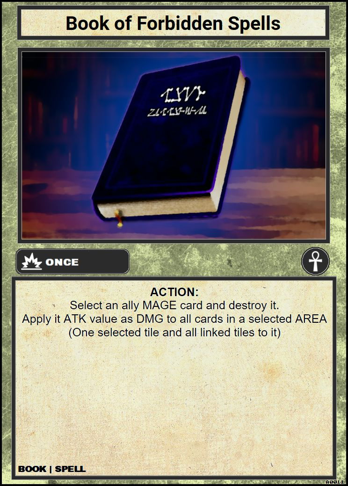
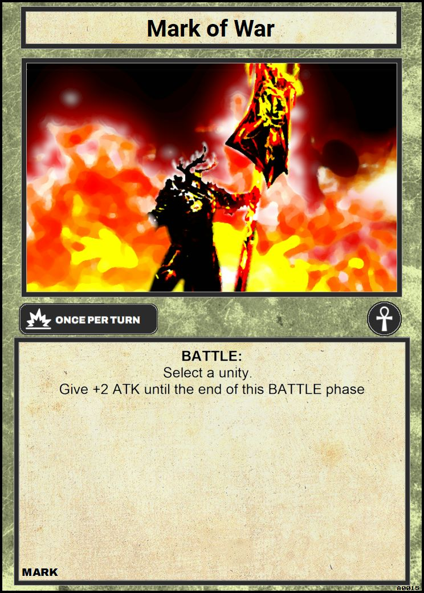
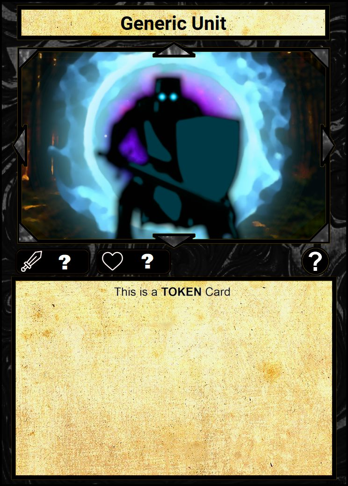

# Dimensional Dominions Regras (PT-BR)

## Introdução

Este é o manual de regras do jogo Dimensional Dominions contendo informações para serem utilizadas na revisão do jogo _v0.4-Alpha_. Toda e qualquer dúvida que não for sanada ou correção referente a este manual pode ser dirigida diretamente neste
[link](https://github.com/dreamblader/dominion-simulator/issues/new?labels=documentation&title=Duvidas/Correções+Regras+PT-BR&assignees=dreamblader)
onde deve ser colocado na parte dos comentários a descrição em detalhes da duvida e/ou correção.

**Este manual pode sofrer alterações durante os periodos de teste Alpha e Beta.**

## Versionamento

Revisão 1 - Manual Foi Criado (06/06/2022)

## Indice

1. [Setup](#setup)
2. [Layout do Jogo](#layout-do-jogo)
3. [Baralho](#baralho)
4. [Cartas](#cartas)
   - [Informações em Comum](#informações-em-comum)
     - [Cartas Unicas](#cartas-unicas)
     - [Subtipos (TAGs)](#subtipos-tags)
   - [Cartas Unidade](#unidade)
     - [Elementos](#elementos)
     - [Informações de Combate](#informações-de-combate)
   - [Cartas Artefato](#artefato)
     - [Tipos de Ativação](#tipos-de-ativação)
       - [Ativação Instantânea (INSTANT)](#ativação-instantânea-instant)
       - [Ativação Unica (ONCE)](#ativação-unica-once)
       - [Ativação Uma Vez Por Turno (ONCE PER TURN)](#ativação-uma-vez-por-turno-once-per-turn)
       - [Ativação Passiva (FOREVER)](#ativação-passiva-forever)
       - [Ativação em Anexo (ATTACH)](#ativação-em-anexo-attach)
       - [Ativação Armadilha (TRAP)](#ativação-armadilha-trap)
   - [Cartas Campo](#campo)
     - [Efeito de Ocupação (OCCUPY)](#efeito-de-ocupação-occupy)
     - [Efeito Adjacente (LINK)](#efeito-adjacente-link)
   - [Cartas Token](#token)
5. [Tipos de Efeitos](#tipos-de-efeitos)
   - [Efeito de Ação (ACTION)](#efeito-de-ação-action)
   - [Efeito de Reação (REACTION)](#efeito-de-reação-reaction)
6. [Zona de Descarte (DZ)](#zona-de-descarte-dz)
7. [Cartas Fora do Jogo (OOG)](#cartas-fora-do-jogo-oog)
8. [Tabuleiro](#tabuleiro)
9. [Objetivo](#objetivo)
10. [Fases](#fases)
    - [Reciclagem (RECYCLE)](#reciclagem-recycle)
    - [Pesca (DRAW)](#pesca-draw)
    - [TICK](#tick)
    - [Movimentação (MOVE)](#movimentação-move)
    - [Combate (BATTLE)](#combate-battle)
    - [Invocação (SPAWN)](#invocação-spawn)
11. [Resumo (TL;DR)](#resumo-tldr)

## Setup

- O jogo consiste em dois jogadores (1x1) com a presença de um tabuleiro.
- Cada jogador deve possuir um deck de 30 cartas que será utilizado durante a partida.
- O jogo começa com cada jogador com 10 pontos de vida em seu Dominio
- Deve-se jogar uma moeda e cada jogador escolher uma face. O campeão então pode escolher entre ser o primeiro ou o segundo a jogar **(Ainda não implementado no jogo)**.

## Layout do Jogo

O jogo é dividido nas seguintes seções de acordo com a imagem acima:

1. Seu [Baralho](#baralho).
2. Sua [Zona de Descarte (DZ)](#zona-de-descarte-dz).
3. [Cartas foras do Jogo (Out Of the Game - OOG)](#cartas-fora-do-jogo-oog).
4. [Zona de Descarte](#zona-de-descarte-dz) de seu adversário.
5. [Baralho](#baralho) do seu adversário.
6. Cartas que estão na mão de seu adversário
7. [Tabuleiro](#tabuleiro)
8. Cartas que estão na sua mão
9. Barra de [Fases](#fases) do Turno.
10. Botão de Finalizar Turno
11. Botão de Gerar uma Carta do tipo [TOKEN](#token)
12. Botões para ativar um evento aleatório como lançar uma moeda ou jogar um dado de 6 ou 8 lados.
13. Informações mais detalhadas da ultima carta que seu mouse passou por cima.

**Todas as seções serão explicadas com mais detalhes neste documento.**

## Baralho

- Todo Baralho deve ter exatamente 30 cartas.
- Seu baralho pode conter apenas duas cartas com o mesmo nome (duplicata), com exceção de cartas ÚNICAS, marcadas com uma estrela.
- Um baralho pode conter cartas do tipo:
  - [Unidade](#unidade)
  - [Artefato](#artefato)
  - [Campo](#campo)
- Seu baralho pode conter qualquer quantidade de qualquer tipo de carta, porém é recomendado utilizar uma quantidade maior de cartas tipo unidade.

## Cartas

Em Dimensional Dominions, todas as cartas são divididas em quatro tipos distintos:

- [Unidade](#unidade)
- [Artefato](#artefato)
- [Campo](#campo)
- [Token](#token)

### **Informações em Comum**

Mesmo tendo grandes diferenças em seus papéis e estilos durante o jogo, muitas das Cartas possuem informações em comuns, como:

- Nome
- Arte
- Estrela de identificação de Carta UNICA
- Simbolo de identidade
- Espaço para descrição de seu efeito ou efeitos
- Subtipos da carta (TAGs)

#### **Cartas Unicas**

- Cartas Unicas são identificadas com um simbolo de uma estrela próximo ao seu simbolo de identidade.
- Cartas que não possuem o simbolo de estrela não são consideradas UNICAS.
- Uma carta considerada UNICA só deve ser alocada uma cópia da mesma em um baralho.

#### **Subtipos (TAGs)**

- Toda carta de qualquer tipo possui no canto inferior esquerdo de sua aba de descrição seus Subtipos (TAGs).
- Toda carta pode possuir um ou mais Subtipos.
- Cartas com mais de um subtipos tem os mesmos separados por uma barra vertical **"|"**.
  - Ex: "Ryu the Twilight Archer" possui 3 Subtipos: "ELF", "TWILIGHT" e "RANGER".
- Subtipos servem para identificação de cartas ou em condições de efeitos.
  - Ex: "Azros King of Thassalos" possui um efeito que só pode ser aplicado em cartas do Subtipo "HUMAN"
- Todo Subtipo (e [Elemento](#elementos) no caso de Cartas Unidades) é referenciado nos efeitos de cartas com todas as suas letras em maiúsculo.

### **Unidade**

Unidade são as principais cartas do jogo, são elas que se movem e travam combates pelo tabuleiro. Elas são as unicas cartas que podem dar dano diretamente no Dominio de seu inimigo.

Elas são compostas dos seguintes itens:

1. Nome da Unidade
2. Range Direcional da Unidade (DIRECTION RANGE)
3. Arte da Carta
4. Pontos de Ataque da Unidade (ATK)
5. Pontos de Vida da Unidade (HP)
6. Range de Distancia da Unidade (RANGE)
7. Estrela que indica que a Carta é [UNICA](#cartas-unicas)
8. Simbolo que identifica o Elemento da Unidade
9. Efeitos da Carta
10. Subtipos da Unidade ([TAGs](#subtipos-tags))

     

#### **Elementos**

Cartas Unidade podem ser divididas nos seguintes elementos:

- Terra (EARTH)
- Agua (WATER)
- Fogo (FIRE)
- Ar (AIR)
- Gelo (ICE)
- Trovão (THUNDER)
- Vazio (VOID)

Essa identificação é feita através do simbolo de identificação na carta em conjunto com sua cor de fundo. Segue uma imagem com um exemplo de carta de cada elemento:

Elementos são usados como identificados das cartas Unidades em conjunto com seus Subtipos ([TAGs](#subtipos-tags))

#### **Informações de Combate**

Cartas Unidade são as unicas cartas que possuem informações para iniciar um combate. Sendo elas:

- Pontos de Ataque (ATK)
- Pontos de Vida (HP)
- Range de Distancia (RANGE)
- Range Direcional (DIRECTION RANGE)

Mais informações de como iniciar um [Combate](#combate) em sua seção .

Caso um efeito de carta afete um de seus status (ou de outras cartas) o mesmo pode especificar o item especifico com sua sigla (ATK, HP ou RANGE), ou colocar todas as informações compactadas no seguinte formato: **"ATK/HP/RANGE"** ou **"ATK/HP"** (nesse caso o RANGE é considerado **ZERO**).

Cartas Unidade que não possuem o status de RANGE visivel, seu RANGE é considerado **ZERO**

### **Artefato**

Artefatos são as cartas que causam efeitos no jogo, podendo alterar o rumo da partida ou causar vantagens e ou desvantagens constantes no jogo.

Elas são compostas dos seguintes itens:

1. Nome do Artefato
2. Arte da Carta
3. [Tipo de Ativação](#tipos-de-ativação) do Artefato
4. Estrela que indica que a Carta é [UNICA](#cartas-unicas)
5. Simbolo que identifica que a carta é um artefato
6. Efeitos da Carta
7. Subtipos do Artefato ([TAGs](#subtipos-tags))

    

#### **Tipos de Ativação:**

Toda carta Artefato possui um tipo de ativação. Cada tipo é unico e possui suas próprias regras de utilização.

Toda carta Artefato possui apenas um dos seguintes tipos de ativação:

- [Ativação Instantânea (INSTANT)](#ativação-instantânea-instant)
- [Ativação Unica (ONCE)](#ativação-unica-once)
- [Ativação Uma Vez Por Turno (ONCE PER TURN)](#ativação-uma-vez-por-turno-once-per-turn)
- [Ativação Passiva (FOREVER)](#ativação-passiva-forever)
- [Ativação em Anexo (ATTACH)](#ativação-em-anexo-attach)
- [Ativação Armadilha (TRAP)](#ativação-armadilha-trap)

##### **Ativação Instantânea (INSTANT)**

- Artefatos do tipo **INSTANT** são considerados cartas instantâneas e podem ser ativadas a QUALQUER MOMENTO DA PARTIDA desde que a condição do efeito da mesma esteja apto para ser ativado.
  - _Exemplo da Imagem: A carta "Duel Invitation" por mais que seja do tipo **INSTANT** possui tipo de efeito de AÇÃO ([ACTION](#efeito-de-ação-action)), ou seja, nesse caso a carta somente pode ser ativada durante o turno do jogador dono da mesma._
- Ao ativa um Artefato **INSTANT** o jogador deve colocar o mesmo VIRADO PARA CIMA em qualquer espaço do campo (sendo vago ou não) e declarar seu efeito.
  - O efeito sera aplicado ou ["contra-atacado"](#efeito-de-reação-reaction) com outra ativação
- Uma vez que o efeito da carta seja aplicado ou negado a carta é mandada instantaneamente para sua zona de descarte ([DZ](#zona-de-descarte-dz))
- O Jogador pode ativar qualquer quantidade de Artefatos do tipo **INSTANT** de sua mão já que sua ativação não é contabilizada como um [SPAWN](#invocação-spawn) de Artefato durante seu turno.
  - Esse é o unico tipo de artefato que burla a contagem de [SPAWN](#invocação-spawn).
  - Esse é o unico tipo de artefato que não pode se alocado com sua face virada para baixo no Tabuleiro.

 

##### **Ativação Unica (ONCE)**

- Artefatos do tipo **ONCE** devem ser colocados em um espaço vago (ou ocupado por um Campo [[FIELD](#campo)] ) durante o turno de [SPAWN](#invocação-spawn) virado para baixo (dormente) ou para acima (ativo).
- Artefatos do tipo **ONCE** contam como 1 [SPAWN](#invocação-spawn) de artefato.
- Uma vez dormente (virada para baixo) a carta pode ser ativada a qualquer momento da partida desde que a condição do efeito da mesma esteja apto para ser ativado.
- Uma vez que o efeito da carta seja aplicado ou negado a carta é mandada instantaneamente para sua zona de descarte ([DZ](#zona-de-descarte-dz))
- Pelo seu nome e ativação, um artefato tipo **ONCE** é uma espécie de artefato **INSTANT** que deve ser invocado corretamente e não é exceção na contagem de invocação.

 

##### **Ativação Uma Vez Por Turno (ONCE PER TURN)**

- Artefatos do tipo **ONCE PER TURN** devem ser colocados em um espaço vago (ou ocupado por um Campo [[FIELD](#campo)] ) durante o turno de [SPAWN](#invocação-spawn) virado para baixo (dormente) ou para acima (ativo).
- Artefatos do tipo **ONCE PER TURN** contam como 1 [SPAWN](#invocação-spawn) de artefato.
- Uma vez dormente (virada para baixo) a carta pode ser ativada a qualquer momento da partida desde que a condição do efeito da mesma esteja apto para ser ativado.
- Uma vez ativado seu efeito a carta recebe um [TICK](#tick) de Cooldown (1 turno) que somente sera retirado no turno de [TICK](#tick) do jogador dono da carta.
- Uma vez ativado o artefato permanece virado para cima no campo e pode ser reativado a qualquer momento desde que:
  - Sua condição de efeito esteja apta para ativar
  - A carta não possua nenhum [TICK](#tick) de COOLDOWN
- Artefatos **ONCE PER TURN** só saem de campo se removidos por outro efeito ou destruidos através de um combate ([BATTLE](#combate-battle))

 

##### **Ativação Passiva (FOREVER)**

- Artefatos do tipo **FOREVER** devem ser colocados em um espaço vago (ou ocupado por um Campo [[FIELD](#campo)] ) durante o turno de [SPAWN](#invocação-spawn) virado para baixo (dormente) ou para acima (ativo).
- Artefatos do tipo **FOREVER** contam como 1 [SPAWN](#invocação-spawn) de artefato.
- Uma vez dormente (virada para baixo) a carta pode ser ativada a qualquer momento da partida desde que a condição do efeito da mesma esteja apto para ser ativado.
- Uma vez ativado o efeito de um artefato do tipo **FOREVER** a carta permanece virada para cima e o efeito passa se tornar passivo no campo, ou seja, enquanto a carta permanecer no campo seu efeito é uma ocorrencia obrigatória do jogo.
- Artefatos **FOREVER** só saem de campo se removidos por outro efeito ou destruidos através de um combate ([BATTLE](#combate-battle))

 

##### **Ativação em Anexo (ATTACH)**

- Artefatos do tipo **ATTACH** devem ser colocados em anexo a uma outra carta durante o turno de [SPAWN](#invocação-spawn) já ativados (virado para cima).
- Artefatos do tipo **ATTACH** contam como 1 [SPAWN](#invocação-spawn) de artefato.
- Artefatos do tipo **ATTACH** pode ser invocado em anexo a qualquer carta desde que a mesma satisfaça sua condição de efeito.
- Artefatos do tipo **ATTACH** não precisam respeitar a [regra de invocação base ou ponte](#invocação-spawn).
- Uma vez anexado o artefato se move junto com a sua carta principal (caso a mesma possa ser movida).
- Uma vez anexado o artefato é destruido junto de sua carta principal.
- O artefato permanece ativo desde sua invocação.
- Artefatos do tipo **ATTACH** só podem ser re-anexados a outra carta por efeitos externos ou do mesmo.
- Artefatos do tipo **ATTACH** não podem ser alvo de um combate. Carta inimigas só podem declarar um ataque a carta principal

 

##### **Ativação Armadilha (TRAP)**

TODO

 

### **Campo**

Cartas Campo são cartas que afetam os espaços fisicos do Tabuleiro com seus efeitos diferenciados.

Elas são compostas dos seguintes itens:

1. Nome do Campo
2. Arte da Carta
3. Estrela que indica que a Carta é [UNICA](#cartas-unicas)
4. Simbolo que identifica que a carta é um campo
5. Efeito de Ocupação do Campo ([OCCUPY](#efeito-de-ocupação-occupy))
6. Efeito de Carta Adjacente ao Campo ([LINK](#efeito-adjacente-link))
7. Subtipos do Campo ([TAGs](#subtipos-tags))

    

- Cartas Campo são as unicas cartas do jogo que podem ser ocupadas fisicamente por outra carta Unidade ou Artefato naturalmente.
- Qualquer Carta que se adeque a ser Invocada (SPAWN) em um espaço ja ocupado por um Campo pode ser Invocada ocupando o mesmo, isso não é valido para outra Carta do Tipo Campo
  - 2 Campos não podem ocupar o mesmo espaço.
- Cartas Campo são consideradas NEUTRAS, ou seja, se uma carta adversário esteja próxima ao seu campo e o efeito do mesmo a beneficia por sua proximidade, ela recebe o beneficio.
- Cartas Campo possuem dois efeitos distintos chamados de Efeito de Ocupação ([OCCUPY](#efeito-de-ocupação-occupy)) e Efeito Adjacente ([LINK](#efeito-adjacente-link)).

#### **Efeito de Ocupação (OCCUPY)**

- Um efeito de ocupação ocorre somente a carta que esteja posicionada acima da Carta Campo.
- Cartas que ocupam o Campo fisicamente também são sujeitas a efeito adjacente ([LINK](#efeito-adjacente-link))

- Cartas que ocupam um campo recebem um "F" no canto superior esquerdo de seu retrato
- Passar o mouse sobre o "F" revela o campo que a carta esta ocupando na aba de informações ([13](#layout-do-jogo))

_Exemplo da Imagem: A carta "Azros The King of Thassalos" ocupa o Campo "Royal Palace", logo ela pega o efeito de Ocupação e faz com que o Campo aplique +2/+2 para qualquer carta adjacente que seja do elemento terra (EARTH). Como ela também recebe o efeito de Link a prórpia carta recebe +2/+2 por ser do subtipo ROYAL._

#### **Efeito Adjacente (LINK)**

- Um efeito adjacente somente ocorre as cartas que estão em um dos 8 espaços adjacentes a Carta Campo.
- Esse efeito tambem se aplica a Carta que Ocupa o Campo (OCCUPY).

_Exemplo da Imagem: A carta "Azros The King of Thassalos" esta adjacente ao canto superior esquerdo do Campo "Royal Palace", logo ela recebe o efeito de Link recebendo +2/+2 por ser do subtipo ROYAL. Caso outra carta do Subtipo ROYAL do Elemento terra (EARTH) ocupasse o Campo, "Azros" não ganharia +4/+4 pelo efeito de LINK, já que o mesmo especifica que o efeito em si não se acumula com o do OCCUPY._

### **Token**

Cartas do Tipo Token podem ser variantes dos três tipos citados:

- Unidade
- Artefato
- Campo

Cartas Token são podem ser geradas a partir de outra Carta.

Cartas que geram Tokens são chamadas de Cartas Geradoras ou Cartas Pai.

Cartas do tipo Token só podem ser geradas no Tabuleiro e não podem ser colocadas no Baralho ou na Mão do jogador. Caso algum efeito faça o Token ser movido para outro local fora do Tabuleiro (Baralho, Mão e etc) o Token é removido do Jogo.

Cartas Geradoras devem especificar o Tipo, Subtipo, Informações de Combate e qualquer outra informação da carta Token. Ex: "Army of Thassalos" especifica que vai criar uma carta do Subtipo SOLDIER com 1 de ATK e 1 de HP do Elemento Terra.

Caso a carta Geradora não especifique uma informação de seu Token é assumido que o Token herda essa informação do Pai. Ex: Um SOLDIER Token criado por "Army of Thassalos" aponta para a mesma direção (DIRECTION RANGE) que sua carta geradora.

 

## Tipos de Efeitos

TODO

### **Efeito de Ação (ACTION)**

TODO

### **Efeito de Reação (REACTION)**

TODO

## Zona de Descarte (DZ)

- Todas as cartas destruidas ou descartadas durante o jogo devem ser colocadas na sua Zona de Descarte (DZ).
- Todas as cartas no DZ são de conhecimento publico dos jogadores.
  - Qualquer jogador pode verificar quais e quantas cartas se encontram em seu DZ ou no DZ de seu adversário.
- Cartas que por algum efeito externo trocaram de controle para seu adversário ou vice-versa quando destruidas são alocadas no DZ de seu jogador original.

## Cartas fora do Jogo (OOG)

- Toda as cartas que por algum efeito próprio ou externo forem removidas completamente do jogo devem ser colocadas neste espaço.
- Todas as cartas alocadas no OOG são de conhecimento publico.
- Cartas no OGG possuem uma borda colorida que sinaliza seu jogador original.
  - Vermelho: Adversário
  - Azul: Sua
- Uma vez que a carta é alocada neste espaço ela esta completamente **FORA DO JOGO**. Nenhum efeito pode ou deve afeta-la, nenhum efeito pode ou deve move-la desse espaço.
  - Existe um botão para realocar a carta do OOG no DZ em caso de missclick.

## Tabuleiro

O Tabuleiro é composto da seguinte maneira:

Dominio é o ponto principal de cada jogador, ele não deve ser preenchido com nenhuma carta e ele diz o numero de pontos de vida restantes do jogador.

Todo jogador começa no Dominio de cor azul e seu adversário no vermelho.

Fisicamente cada jogador ficaria em um lado oposto da mesa onde cada um ficaria de frente para um Far-End diferente, fazendo com que as cartas de seu adversário fiquem de cabeça para baixo em sua perspectiva. Isto é feito automaticamente na versão digital.

Por este motivo é relativo chamar um Far-End ou Main-End de Norte ou Sul, pois o Far-End Norte na sua perspectiva seria o Far-End Sul na perspectiva do jogador adversário.

## Objetivo

O jogador que reduzir a vida do Dominio de seu adverário a **ZERO** é considerado o vencedor.

O jogador pode declarar um ataque contra o Dominio de seu adversário se:

- Possuir uma carta do tipo unidade nas zonas adjacentes do Dominio de seu adversário (zonas coloridas).
- Cartas unidades com ataque a distancia não podem atacar o dominio a distancia, elas tambem devem respeitar a regra acima.
- Cartas unidades que se encontra na zona adjacente podem atacar o Dominio mesmo que seu campo direcional não aponte para a localização fisica do Dominio.

Uma vez declarado o ataque os pontos de vida do Dominio serão reduzidos pelo tanto de ataque da carta que o declarou.

Se o jogador estiver sem recursos para continuar o jogo (sem cartas no tabuleiro, sem cartas no baralho, sem cartas na mão) ele é declarado derrotado automaticamente.

Caso o jogo entre num empasse em que ambos os jogadores não conseguem sair do estado atual (cartas não conseguem se mover, atacar e ser invocadas no tabuleiro). O jogo é considerado um **EMPATE**.

## Fases

TODO

### **Reciclagem (RECYCLE)**

TODO

### **Pesca (Draw)**

TODO

### **TICK**

TODO

### **Movimentação (MOVE)**

TODO

### **Combate (BATTLE)**

TODO

### **Invocação (SPAWN)**

TODO

## **Resumo (TL;DR)**

TODO
